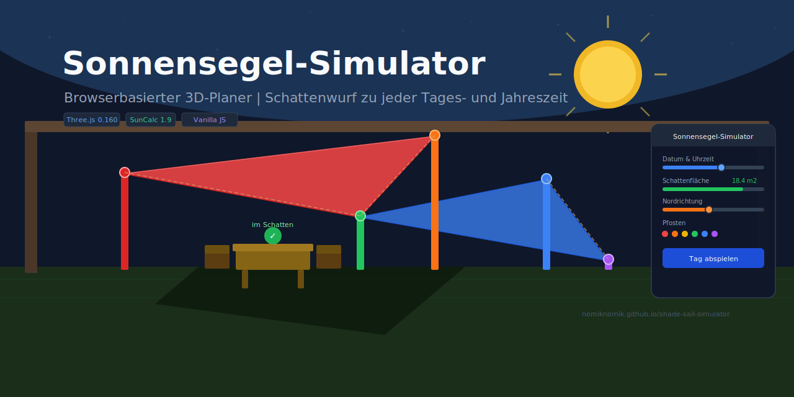
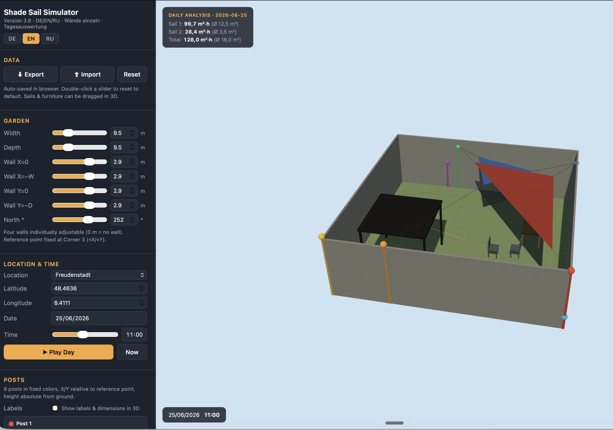
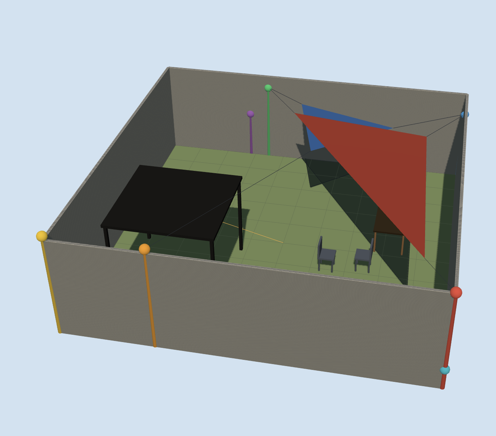
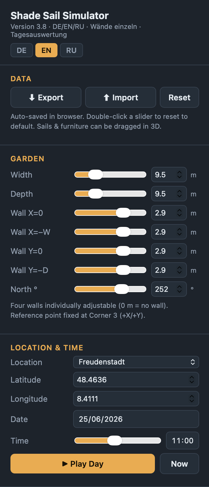
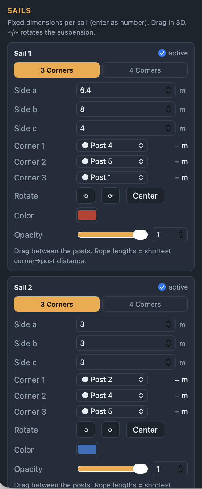
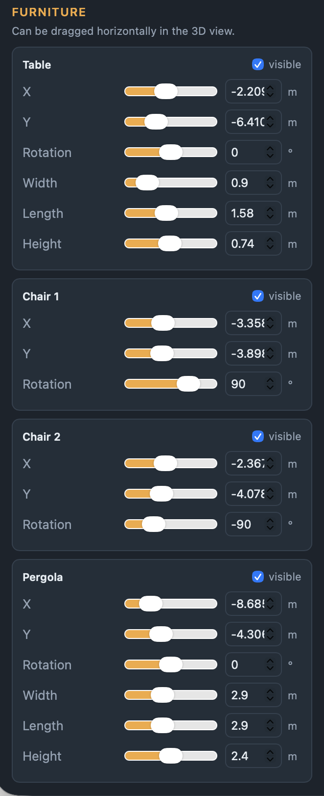
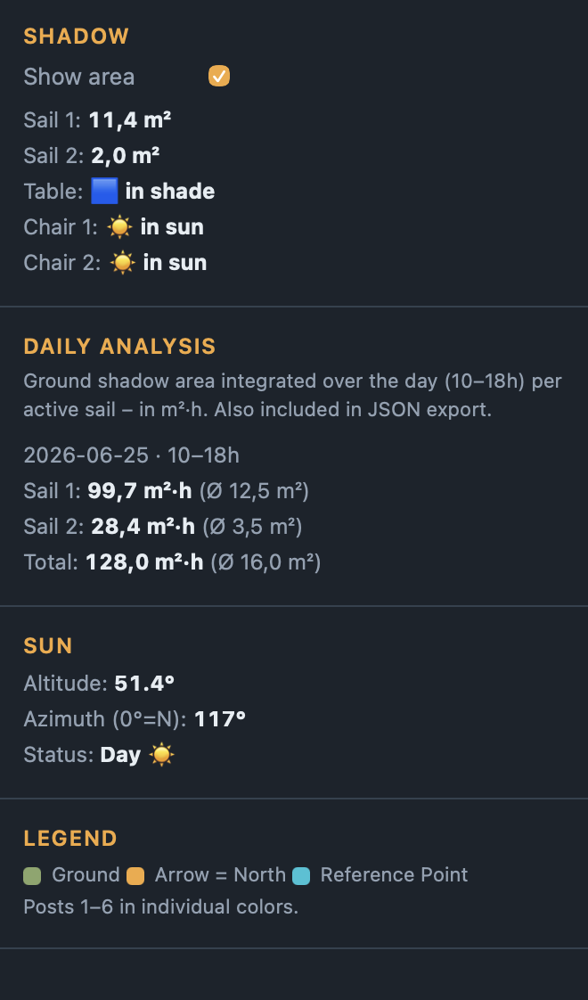

<div align="center">

# 🌞 Shade Sail Simulator

**Browser-based 3D planner for shade sails (Sonnensegel)**  
Visualizes shadow casting, sail orientation, and furniture shading at any time of day and year.



[](https://nomiknomik.github.io/shade-sail-simulator/)
[](#quick-start)
[](https://threejs.org)
[](#changelog)

</div>

---

## 📸 Screenshots

<div align="center">

| Full Application | 3D View |
|:---:|:---:|
|  |  |

| Control Panel — Garden & Time | Posts & Sails |
|:---:|:---:|
|  |  |

| Furniture Settings | Shadow & Daily Analysis |
|:---:|:---:|
|  |  |

> *Screenshots: Shade sail over garden furniture, summer morning, Freudenstadt*

</div>

---

## ✨ Features at a Glance

| | |
|---|---|
| 🏡 **Real garden** | Width, depth, 4 individually adjustable wall heights, north offset |
| ☀️ **Accurate sun** | Astronomically correct via SunCalc — location, date, time |
| 🪵 **6 anchor posts** | Direct X/Y/H input, color-coded, toggleable 3D labels |
| ⛵ **Up to 2 sails** | Triangle or rectangle, any size and color |
| 🔵 **Auto-orientation** | Horn quaternion best-fit: sail hangs correctly between posts automatically |
| 📐 **Shadow area** | Live calculation in m² per sail, clipped to garden boundary |
| 📊 **Daily analysis** | Integrated shadow area 10–18h in m²·h per sail |
| 🪑 **Furniture shading** | Table, chairs, pergola: shows whether each piece is in shade or sun |
| 🎬 **Time animation** | Play shadow movement across 24 hours |
| 🌍 **Multilingual** | DE / EN / RU — switchable at runtime |
| 💾 **Auto-save** | localStorage + JSON export/import |

---

## 🚀 Quick Start

```bash
# Option A: open directly (Chrome recommended)
open index.html

# Option B: local server (if file:// issues in Safari)
python3 -m http.server 8080
# → Browser: http://localhost:8080
```

> **No build tool, no npm, no installation.**  
> Only requirement: internet connection on first open (CDN libraries).

### 🌐 Use Online

**→ [nomiknomik.github.io/shade-sail-simulator](https://nomiknomik.github.io/shade-sail-simulator/)**

---

## 🗺️ How It Works

```
┌─────────────────────────────────────────────────────┐
│                 index.html  (everything in one file) │
│                                                      │
│  ┌─────────────┐    ┌──────────────────────────┐    │
│  │   Control   │    │     Three.js 3D Scene     │    │
│  │   Panel     │───▶│  Garden · Posts · Sails   │    │
│  │  (left      │    │  Furniture · Shadows       │    │
│  │   side)     │    │                           │    │
│  └─────────────┘    └──────────────┬────────────┘    │
│                                    │                 │
│                         ┌──────────▼─────────┐       │
│                         │  SunCalc Library   │       │
│                         │  Azimuth+Elevation │       │
│                         │  (real-time)       │       │
│                         └────────────────────┘       │
└─────────────────────────────────────────────────────┘
```

---

## 🎮 3D View Controls

| Action | Input |
|---|---|
| 🔄 Rotate camera | `Left mouse button` + drag |
| 🔍 Zoom | Mouse wheel |
| ↔️ Pan camera | `Right mouse button` + drag |
| ✋ **Move sail** | `Left mouse button` on sail + drag |
| ⟲ ⟳ Rotate corner assignment | Buttons in post panel |
| 🔁 Double-click slider | Reset to default value |
| 🖱️ **Move furniture** | `Left mouse button` on furniture + drag |

---

## 🪵 Post Input

Each post is positioned relative to the **reference point** (fixed at garden corner 3, +X/+Y).
Enter X offset, Y offset, and absolute height H in meters.

```
Post input:
  X   (m)   — horizontal offset from reference point
  Y   (m)   — depth offset from reference point
  H   (m)   — absolute height above ground
```

Rope lengths are **calculated outputs**, not inputs — they update live as you adjust posts.

---

## 🏗️ Technical Stack

| Library | Version | Purpose |
|---|---|---|
| [Three.js](https://threejs.org) | 0.160 | 3D rendering, PCFSoft Shadow Maps |
| [SunCalc](https://github.com/mourner/suncalc) | 1.9 | Astronomical sun position |
| Vanilla JS | ES2022 | No framework, no build tool |

**Sail algorithm:** Horn quaternion best-fit registration.  
Minimizes residuals between post positions and sail corners while keeping sail dimensions fixed.  
The root coordinate system is relative to the user-defined reference point — matching how laser distance meter measurements are naturally taken.

---

## 📁 Project Structure

```
shade-sail-simulator/
├── index.html         ← complete app (~966 lines)
├── README.md          ← this file
├── DEVELOPER.md       ← technical reference for contributors
└── screenshots/       ← app screenshots (see SCREENSHOTS.md)
```

---

## 🗓️ Default Configuration (real garden measurements)

```
Garden:      9.5 × 9.5 m  ·  all 4 walls 3 m  ·  North 229°
Location:    Freudenstadt, DE  (48.4636° N / 8.4111° E)

Post 1 🔴   X=  0.0   Y=  0.0   H=2.9 m
Post 2 🟠   X= −7.0   Y=  0.0   H=3.0 m
Post 3 🟡   X= −9.5   Y=  0.0   H=3.0 m
Post 4 🟢   X= −6.2   Y= −9.5   H=2.5 m
Post 5 🔵   X=  0.0   Y= −9.5   H=2.5 m
Post 6 🟣   X=  2.5   Y=  7.5   H=3.0 m

Sail 1:   Triangle  6.4 / 8.0 / 4.0 m  ·  Posts 4–5–1
Sail 2:   (disabled)
```

---

## 🔮 Planned Features

- [ ] **Draggable posts** — move posts with mouse (like sail drag)
- [ ] **Triangle validation** — warning for invalid side lengths (a+b < c)
- [ ] **Rope slack warning** — when sail is significantly smaller than post spacing
- [ ] Additional furniture / objects (parasol, plant pots)
- [ ] Obstacles (house wall, tree)

---

## ⚠️ Known Limitations

- Sail is a **flat rigid panel** — no sag/catenary (by design)
- Shadow area is clipped to garden boundary via Sutherland-Hodgman algorithm
- Furniture shade test uses one measurement point per object (not entire surface)
- Sail drag is horizontal only (no height change via mouse)

---

## 📋 Changelog

| Version | Changes |
|---------|---------|
| **3.8** | Multilingual UI: DE / EN / RU; enlarged 3D labels (13px / 96px); shadow area clipped to garden boundary (Sutherland-Hodgman); persistent daily analysis HUD overlay |
| 3.6 | 4 individually adjustable wall heights; pivot-corner rotation for furniture; location selector (6 cities); daily shade analysis (10–18h, m²·h) |
| 3.5 | Initial GitHub publish; README.md + DEVELOPER.md added |
| 3.4 | Removed laser/polar input; fixed reference point at corner 3; label toggle; sail dimensions as number inputs; Pergola furniture; furniture drag; sail physics fix |
| 3.3 | Initial version: garden, 6 posts, 2 sails, furniture, Horn quaternion best-fit, drag, localStorage |

---

## 📄 License

Private project. No public release.

---

<div align="center">

Made with ☀️ in Freudenstadt, Germany

</div>
